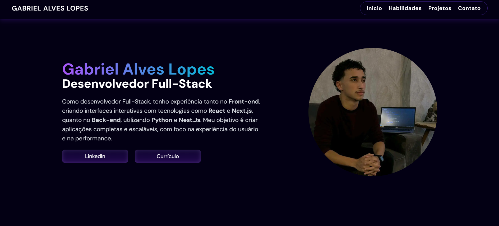

# Portfólio



[`Clique para visitar o site`](https://portfolio-gabrielgal.vercel.app)

## Descrição
O **Portfólio** é um site desenvolvido com o objetivo de apresentar, de forma clara, moderna e profissional, quem eu sou como desenvolvedor. Funciona como um cartão de visita digital, onde visitantes podem conhecer minhas habilidades técnicas, os projetos que já desenvolvi, e entrar em contato comigo com facilidade.

## Tecnologias Usadas

- **Next.Js**: Framework React que permite a criação de interfaces modernas, rápidas e responsivas.
- **Tailwind CSS**: Utilizado para estilização com foco em responsividade, animações suaves e facilidade do uso.
- **TypeScript**: Linguagem que adiciona tipagem ao JavaScript, garantindo maior segurança e organização no código.
- **React Toastify**: Biblioteca utilizada para exibir notificações de forma elegante e funcional.
- **FormSubmit**: Serviço usado para envio de emails de forma simples e sem necessidade de backend.

## Como Usar

### 1. Clone o repositório:

```bash
git clone https://github.com/gabriel-gal/portfolio.git
```

### 2. Acesse o diretório do projeto:

```bash
cd portfolio
```

### 3. Instale as dependências:

```bash
npm install
```


### 4. Execute o servidor de desenvolvimento:

```bash
npm run dev
```

### 5. Acesse o projeto no navegador: http://localhost:3000